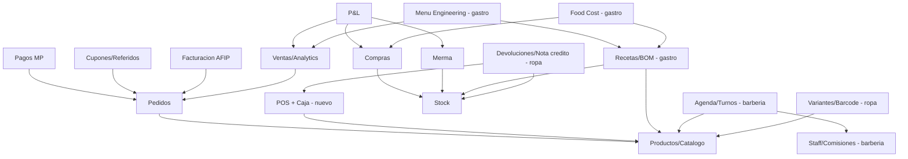

# Arquitectura modular — de hermes-gastro a plataforma multi-rubro

> Analisis del 6/jul/2026. Objetivo: separar el sistema en modulos para
> especializarlo por rubro (gastro / barberia / ropa) sin triplicar mantenimiento.
> Basado en inventario real del repo, INFORME-QAJAR.md y research de sistemas USA.

---

## 0. Decision recomendada (leer primero)

**Un solo codebase, un solo schema, packs de modulos activados por vertical.**
NO forkear un repo por rubro. Razones:

1. Ya tenes la infraestructura exacta para esto: `feature_flags` en DB (con
   `RECIPES_WITH_INGREDIENTS`, `DELIVERY_ENABLED`, etc.) cargados al boot, y
   build por tenant con `CLIENT=`. Falta solo una dimension `vertical`.
2. Tus bugs recurrentes documentados (corrupcion UTF-8, Zod-sync, chunks viejos)
   se arreglan una vez. Con 3 forks se arreglan 3 veces, para siempre.
3. Es el modelo de la industria: Squire, Booksy y Lightspeed no son productos
   distintos por rubro — son un core + modulos con vocabulario cambiado.

Mecanica: `vertical` como config del tenant (en `settings` o build-time como
`CLIENT`), un **module registry** que decide que rutas/nav/servicios se montan,
y tablas de packs verticales que quedan vacias en tenants de otro rubro
(costo cero en Postgres).

---

## 1. Inventario real de modulos (lo que YA construiste)

Relevado de `src/components/admin`, `src/services`, `supabase/functions` y
migrations. Clasificacion: **CORE** = sirve a cualquier rubro. **GASTRO** =
especifico del vertical actual.

| # | Modulo | UI | Servicio | Tablas | Clase |
|---|--------|----|----------|--------|-------|
| 1 | Auth + Roles | LoginScreen, Users | adminUsers, auth, phoneAuth | admin_users, profiles, addresses | CORE |
| 2 | Settings | Settings (secciones) | settings + Zod schemas | settings | CORE |
| 3 | Branding/Tema | BrandModal, Personalizacion | theme | theme_config | CORE |
| 4 | Catalogo publico | catalog-pro/*, get-catalog | catalog, categories | recipes*, category_groups, favorites, info_pages | CORE (con * abajo) |
| 5 | Pedidos | Orders, OrderTracker | orders, activeOrders | orders, order_items | CORE |
| 6 | Pagos | MpCallback/MpStatus | paymentIntegrations, payments | payment_integrations + mp-* functions | CORE |
| 7 | Ventas/Analytics | Analytics + analytics/*, MonthSummary | finance (parte) | orders, sales | CORE |
| 8 | Venta manual | (dentro de Finance) | finance.createSale | sales | CORE — embrion del POS |
| 9 | Stock | Stock | inventory, stockAvailability | ingredients*, adjust_stock RPC | CORE (con * abajo) |
| 10 | Compras | Finance (tab) | finance | purchases, purchase_items | CORE |
| 11 | Gastos | Finance (tab) | finance | expenses | CORE |
| 12 | Proveedores | Suppliers | suppliers | suppliers | CORE |
| 13 | Merma | Waste | inventory | waste_log | CORE (ropa lo llama "shrinkage") |
| 14 | CRM | CRM | crm | customers, orders | CORE |
| 15 | Cupones + Referidos | (checkout + admin) | coupons, referrals | coupons, referrals | CORE |
| 16 | Push | PushNotifications | push | push_subscriptions, send-push | CORE |
| 17 | Facturacion AFIP | Invoicing | invoices | invoices, afip-invoice | CORE |
| 18 | QRs dinamicos | DynamicQrs | qrs | dynamic_qrs | CORE |
| 19 | Reportes/exports | — | exports, monthReport | scheduled-export, hermes-daily-report | CORE |
| 20 | Feature flags | — | featureFlags | feature_flags | CORE (infra) |
| 21 | **Recetas/BOM** | Recipes, BatchCalculator, SizesEditor | recipes | recipes, recipe_ingredients, ingredients, combo_items | **GASTRO** |
| 22 | **Menu Engineering** | MenuEngineering | — | recetas + ventas | **GASTRO** |
| 23 | **Food Cost teorico** | TheoreticalFoodCost | — | recetas + compras | **GASTRO** |
| 24 | **P&L con costo por receta** | UsarPnL | finance | todo lo anterior | **GASTRO** (un P&L generico es CORE) |
| 25 | **Delivery/scheduling/combos** | SchedulePicker, SuperCombos | deliveryChannels | delivery_channels, combo_items | **GASTRO** (delivery); combos sirven en retail como "bundles" |

Los 3 (o 4) modulos con asterisco son el nudo del problema — siguiente seccion.

---

## 2. El acoplamiento central a romper

Hay UNA decision de diseño que hoy ata todo al rubro gastro:

**`recipes` es a la vez el catalogo de productos Y la receta.**
`get-catalog` y `catalog.js` leen de `recipes`. El stock vive en `ingredients`
(insumos), no en productos. La disponibilidad de un producto se deriva de sus
ingredientes.

Eso es correcto para gastro y no sirve para nada mas:

| Concepto | Gastro (hoy) | Barberia | Ropa |
|----------|--------------|----------|------|
| Lo que se vende | receta (BOM de insumos) | servicio (duracion + staff) + productos retail | producto con variantes (talle/color) |
| Donde vive el stock | ingredients (insumos) | opcional: insumos backbar + retail simple | POR VARIANTE (cada talle/color = SKU) |
| Disponibilidad | derivada del BOM | agenda del staff | stock directo de la variante |

**Modelo objetivo:** una entidad `products` (lo vendible) con `type`:

- `composite` — tiene BOM (`recipe_ingredients`). Stock derivado. = gastro hoy.
- `simple` — stock directo propio. = retail generico, bebidas comprando-revendiendo.
- `variant_parent` + tabla `product_variants` (talle/color/atributos, stock y
  barcode por variante). = ropa. Lightspeed hace exactamente esto ("matrix":
  hasta 3 atributos, cada combinacion es un SKU con stock propio).
- `service` — sin stock, con `duration_min` y staff asignable; consumo opcional
  de insumos (un corte gasta navaja/shampoo — es un BOM light opcional). = barberia.

Camino de migracion barato: NO renombrar `recipes` de una (romperia los 3
tenants). Paso 1 es agregar `type` a recipes con default `composite` y que
catalog/get-catalog/orders dejen de asumir BOM. `ingredients` pasa a ser el
almacen de "items stockeables no vendibles"; en ropa casi no se usa porque el
stock esta en las variantes.

`order_items` guarda snapshot de precio/costo (`unit_price`, `unit_cost`) y no
usa el BOM — funcionalmente pedidos, pagos, cupones y facturacion ya son
multi-rubro. PERO su FK se llama `recipe_id` y apunta a `recipes` (verificado en
000_initial_schema.sql): por eso `products` debe ser la MISMA tabla evolucionada
(rename o vista), no una tabla nueva — o migras los historicos.

---

## 3. Research: como lo resuelven los sistemas USA

### 3.1 Barberias (Squire, Booksy, Boulevard, GlossGenius, Zenoti)

El mercado USA es claro: **el modulo ancla es la agenda, no el POS**. Todo lo
demas orbita alrededor del turno.

Modulos estandar del rubro:

- **Booking online + recordatorios** SMS/push (reduccion de no-shows; algunos
  cobran fee por no-show con tarjeta guardada). Walk-in queue ademas de turnos.
- **Ficha de cliente**: historial de cortes, fotos, notas del barbero,
  preferencias. Es EL dato retenido — equivale a tu CRM + un historial por visita.
- **Staff**: comisiones por servicio/producto, alquiler de silla (booth rent —
  Squire "Rent Collect"), time clock, payroll, login por empleado.
- **POS integrado a la agenda**: el checkout arranca desde el turno; propinas;
  venta de productos retail (upsell pomada/shampoo) con stock simple.
- **Memberships y paquetes** (x cortes prepagos, suscripcion mensual).
- **Marketplace/discovery** (Booksy): adquisicion de clientes. No aplica a tu
  escala hoy, pero es el loop viral que QAJAR hace con su footer.

Precios USA: GlossGenius $24/mes (solo), Booksy ~$30 + $20/staff, Squire
$30-250/mes, Boulevard $176+. El rubro paga por AGENDA + comisiones, no por stock.

Que ya tenes que ellos cobran caro: push notifications propias, CRM con
cumpleanos/regalos, cupones/referidos, tienda online white-label por tenant.

### 3.2 Ropa (Lightspeed Retail, Shopify POS, Square for Retail)

Modulo ancla: **inventario por variante (matrix)**.

- **Matrix inventory**: producto padre + atributos (talle/color/fit, max 3 en
  Lightspeed), cada combinacion = SKU con stock, precio y barcode propios.
- **Barcode end-to-end**: etiquetas, scan para vender, scan para recibir compra.
- **Purchase orders** con recepcion parcial y catalogos de proveedor
  importables; reorder points por variante.
- **Cambios/devoluciones/nota de credito** (store credit): estandar absoluto
  del rubro — en ropa el cambio de talle es flujo diario, no excepcion.
- **E-com sincronizado con el local** (Shopify: mismo catalogo, mismo stock,
  cero delay). Tu catalogo-pro + stock unificado ya apunta ahi.
- **Liquidaciones/markdowns por temporada**, multi-sucursal con transferencias,
  reportes de rotacion y dead stock.

Precios USA: Lightspeed $89-289/mes, Shopify POS Pro ~$89/mes/local + plan.

Tu modulo de compras + proveedores + merma ya cubre la mitad del rubro; lo que
falta es variantes + barcode + devoluciones con nota de credito.

---

## 4. Que tomar del informe QAJAR y donde encaja

La conclusion mas importante de cruzar QAJAR con los verticales: **el POS
presencial + caja que a hermes le falta es CORE, no un capricho gastro** —
barberia y ropa cobran EN el local si o si. Es el modulo nuevo de mayor
palanca porque desbloquea los dos rubros nuevos Y sirve a Mala Miga/LNP en
mostrador.

Del informe, al modulo **POS + Caja (core)**:

- Carrito con busqueda por nombre/barcode, venta rapida ($importe sin producto)
- Apertura/cierre de caja con arqueo, historial de cajas
- MercadoPago QR dinamico presencial
- Pago mixto (split), recargo tarjeta / descuento efectivo, metodos custom
- Cuenta corriente de clientes (fiado) — en barberia/B2B se usa mucho
- Datos de posnet (compania, ultimos 4, cuotas)
- Impresion termica de ticket (y etiquetas — eso lo pide ropa)

Del informe, a modulos core existentes (independiente de la verticalizacion):

- Estado de pago en compras (deuda a proveedores) → modulo Compras
- Meta del dia + hoy-vs-ayer → Home admin
- Carga de factura de compra por foto (OCR+LLM) → Compras
- Presupuestos convertibles a venta → util en ropa (mayorista) y catering
- Permisos granulares por empleado → necesario para barberia (staff usa el POS)

Ya tenias esta priorizacion en INFORME-QAJAR.md seccion final; sigue valida.

---

## 5. Respuesta directa: que modulos funcionan solos y cuales no

### Independientes (funcionan sin ningun otro modulo de negocio)

| Modulo | Nota |
|--------|------|
| Auth + Roles | base de todo, pero el no depende de nadie |
| Settings | idem |
| Branding/Tema | solo lee settings/storage |
| Proveedores | tabla plana |
| Gastos | tabla plana |
| QRs dinamicos | 100% autonomo |
| Info pages | 100% autonomo |
| Push | necesita suscriptores, no necesita ventas ni stock |
| CRM (base) | la ficha de cliente vive sola; las metricas de gasto vienen de Pedidos |
| Feature flags | infra |

### Dependencias duras (no funcionan sin su dependencia)

Regla practica de empaquetado: **el "kernel" minimo vendible a cualquier rubro
es Auth + Settings + Productos + POS/Pedidos + Pagos + Ventas.** Stock, Compras,
Gastos, CRM, Push, Cupones y Facturacion son opcionales activables. Los packs
verticales cuelgan de ahi:

- **Pack gastro:** BOM/Recetas, Menu Engineering, Food Cost, delivery/scheduling,
  combos. (= lo que hoy esta mezclado con el core)
- **Pack barberia:** Agenda/turnos, Staff+comisiones, ficha de visita (foto/nota
  del corte), memberships. "Recetas" desaparece del nav; "Servicios" son
  products type=service. Consumo de insumos backbar = BOM light opcional.
- **Pack ropa:** Variantes+barcode, Devoluciones/nota de credito, etiquetas,
  temporadas/markdowns. Sin BOM. Merma se renombra "ajustes/shrinkage".

## 6. Como implementarlo (mecanica concreta)

1. **Module registry** (`src/modules/registry.js`): cada modulo declara
   `{ id, navItem, routes, requiredFlags, vertical: ['gastro','barber','retail'] }`.
   BottomNav, AdminDrawer y las rutas lazy del admin se generan de ahi en vez
   de estar hardcodeadas. Es refactor de UI, no de datos.
2. **`vertical` por tenant**: columna en `settings` (runtime, ya cargas flags
   al boot) — no hace falta otra env de build. `CLIENT=` sigue igual.
3. **Vocabulario por vertical**: ya tenes `src/locales/es-AR/common.json`;
   agregar namespace por vertical (gastro: "Recetas", barber: "Servicios",
   retail: "Productos"). Cero renombres en codigo.
4. **Datos**: fase A agrega `products.type` (alias sobre recipes) +
   `product_variants` + tablas del pack barberia (`staff`, `services` como
   products, `appointments`). Mismo schema en todos los tenants; tablas ajenas
   al vertical quedan vacias. El pre-commit schema-sync sigue funcionando igual.
5. **Orden de construccion sugerido:**
   - F1. POS + Caja core (QAJAR como spec) — sirve YA a los 3 tenants gastro.
   - F2. `products.type` + registry + nav por vertical (refactor sin features).
   - F3. Pack barberia (agenda es el 80% del valor del rubro).
   - F4. Pack ropa (variantes + devoluciones).
   Barberia antes que ropa: el pack es mas chico (agenda+staff vs
   variantes+barcode+devoluciones) y tenes clientes esperando en ambos — pero
   validalo contra cual cliente paga primero.

## 7. Riesgos honestos

- El refactor `recipes` → `products` toca `get-catalog`, `catalog.js`,
  `submit-order` y el Zod schema: es exactamente la zona de tus 4 bugs de
  schema-sync historicos. Hacerlo en una fase propia (F2), sin features nuevas
  mezcladas, con el manifest actualizado en el mismo commit.
- La agenda de barberia parece simple y no lo es: solapamientos, buffers,
  recurrencia, zonas horarias, no-shows. Es EL producto del rubro (Squire vive
  de eso a $100+/mes). Presupuestar como un modulo grande, no como un CRUD.
- Cada vertical nuevo multiplica proyectos Supabase+Vercel con tu modelo
  1-tenant-1-proyecto. Para 3 dark kitchens funciona; para vender barberias de
  a 10 vas a necesitar el modelo QAJAR (una DB multi-comercio) o automatizar
  el onboarding por completo (ONBOARDING.md hoy es manual). No hace falta
  decidirlo ahora, pero no lo pierdas de vista en Sprint "vendible".

## Fuentes research USA

- Squire: https://getsquire.com/ (features POS/booth rent), https://getsquire.com/pricing
- Comparativas barberia 2026: https://thesalonbusiness.com/best-barbershop-software/, https://www.zenoti.com/thecheckin/best-barbershop-software-2026
- Booksy vs GlossGenius: https://www.capterra.com/compare/142741-174830/Booksy-vs-GlossGenius
- Lightspeed apparel/matrix: https://www.lightspeedhq.com/pos/retail/apparel/, https://retail-support.lightspeedhq.com/hc/en-us/articles/229130188-Creating-matrixes
- POS ropa 2026: https://www.posusa.com/clothing-store-pos-system/, https://www.shopify.com/compare/shopify-vs-lightspeed
